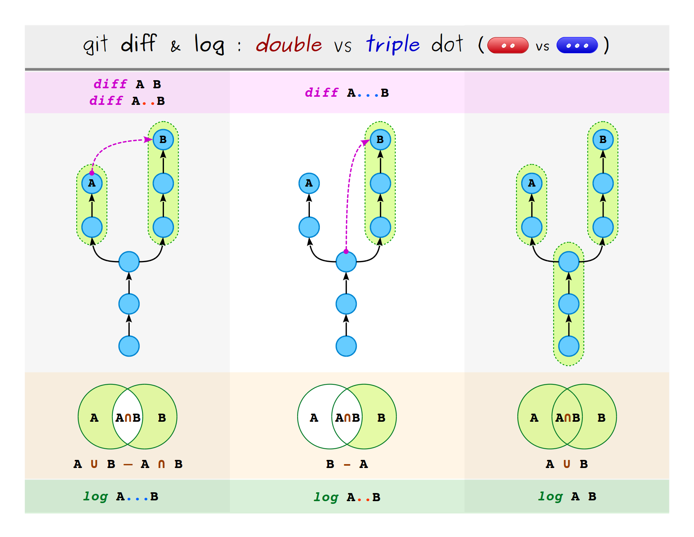
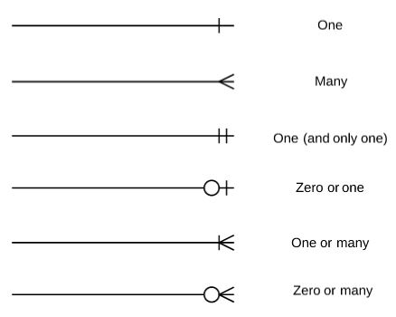

<!-- TODO: move exaplanations to extended.md. -->

# Basic knowledge <!-- omit in toc -->

Basic general concepts to work with.

## Table of contents <!-- omit in toc -->

- [Windows](#windows)
- [Command line](#command-line)
  - [CMD](#cmd)
  - [Bash](#bash)
  - [PowerShell](#powershell)
- [Git](#git)
  - [Basic operations](#basic-operations)
  - [Complex actions](#complex-actions)
    - [Interactive rebase](#interactive-rebase)
    - [Remove multiple branches](#remove-multiple-branches)
    - [Return to previous moment](#return-to-previous-moment)
  - [Multiple repositories to a mono repo](#multiple-repositories-to-a-mono-repo)
  - [Errors and problems](#errors-and-problems)
  - [GitHub](#github)
    - [Compare commits](#compare-commits)
- [Coding](#coding)
  - [Java](#java)
    - [Spring Boot (Spring)](#spring-boot-spring)
    - [Jackson (JSON)](#jackson-json)
      - [Mixins](#mixins)
    - [JUnit](#junit)
    - [Logging](#logging)
  - [JavaScript](#javascript)
  - [Angular](#angular)
    - [Testing](#testing)
      - [Karma](#karma)
    - [Code samples](#code-samples)
  - [Cypress](#cypress)
  - [HTML](#html)
  - [Markdown](#markdown)
  - [R Markdown](#r-markdown)
  - [YAML](#yaml)
  - [Prettier](#prettier)
  - [Database](#database)
    - [PSQL](#psql)
  - [Scripts](#scripts)
- [Package managers](#package-managers)
  - [Maven](#maven)
  - [NPM](#npm)
  - [Yarn](#yarn)
- [Browsers](#browsers)
  - [Chrome](#chrome)
  - [Edge](#edge)
  - [Internet Explorer](#internet-explorer)
- [Tools](#tools)
  - [IntelliJ](#intellij)
    - [Debug](#debug)
- [Others](#others)
  - [Postman](#postman)
    - [Request encoding type: x-www-form-urlencoded](#request-encoding-type-x-www-form-urlencoded)
    - [Reference other request on pre-request script](#reference-other-request-on-pre-request-script)
  - [ConEmu](#conemu)
  - [CORS](#cors)
  - [OpenShift](#openshift)
  - [Regex](#regex)
  - [Unclassified topics](#unclassified-topics)

## Windows

- Run batch file from Explorer context menu: [1](https://www.ghacks.net/2017/07/18/how-to-delete-large-folders-in-windows-super-fast/), [2](https://pureinfotech.com/delete-large-folder-fast-windows-10/). <!-- move to extended.md -->
- Close APP connection using specified port:

  ```batch
  netstat -ano | findstr <port>
  taskkill /F /PID <PID>
  ```

- Environment variables:
  - `Win` + `R` > CMD > `rundll32.exe sysdm.cpl,EditEnvironmentVariables`
  - File explorer > `Control Panel\All Control Panel Items\User Accounts`.
- Credential Manager: `Control Panel\All Control Panel Items\Credential Manager`.
<!-- Panel de control\Todos los elementos de Panel de control\Administrador de credenciales -->

## Command line

- Exit command line: `q`.
- [Redirect messages from command prompt (Windows)](https://docs.microsoft.com/en-US/troubleshoot/cpp/redirecting-error-command-prompt):

<!-- markdownlint-disable MD033 -->

| Redirected stream        | Instruction                                  | Example                                  | More                                                                  |
| ------------------------ | -------------------------------------------- | ---------------------------------------- | --------------------------------------------------------------------- |
| STDOUT                   | `<command> > <file>`, `<command> 1> <file>`  | `dir > stdout.txt`                       | <ul><li>The file can be `nul`.</li><li>Use `>>` for append.</li></ul> |
| STDERR                   | `<command> 2> <file>`                        | `dir abc.xxx 2> stderr.txt`              | ^                                                                     |
| Both in separated files. | `<command> > <stdout file> 2> <stderr file>` | `dir abc.xxx > stdout.txt 2> stderr.txt` | ^                                                                     |
| Both in a single file.   | `<command> > <file> 2>&1`                    | `dir abc.xxx > both.txt 2>&1`            | ^                                                                     |

<!-- markdownlint-enable MD033 -->

<!-- TODO: redirection input <, CMD=https://ss64.com/nt/syntax-redirection.html, bash=https://linuxcommand.org/lc3_lts0070.php,https://thoughtbot.com/blog/input-output-redirection-in-the-shell -->

### CMD

- Open File Explorer using CMD: `start <path>`, e.g., `start .`.
- Remove -enclose `<names>` or `<path>` with `"` when spaces in the string, e.g., `del /f/s/q "a b"`-:
  - [Files](https://docs.microsoft.com/en-us/windows-server/administration/windows-commands/del): `del /f/s/q <names> > nul`, e.g., `del /f/s/q *.* > nul`.
    - `<names>`: specifies a list of one or more files or directories. Wildcards may be used to delete multiple files. If a directory is specified, all files within the directory will be deleted.
    - `/f`: forces deletion of read-only files.
    - `/s`: deletes specified files from the current directory and all subdirectories. Displays the names of the files as they are being deleted.
    - `/q`: specifies quiet mode. You are not prompted for delete confirmation.
    - `> nul`: disables the console output and improve the performance and speed.
  - [Directory](https://docs.microsoft.com/en-us/windows-server/administration/windows-commands/rmdir): `rmdir /s/q <path>`, e.g., `rmdir /q/s .`.
    - `/s`: deletes a directory tree (the specified directory and all its subdirectories, including all files).
    - `/q`: specifies quiet mode. Does not prompt for confirmation when deleting a directory tree. The `/q` parameter works only if `/s` is also specified.
  - [Add context menu option](https://pureinfotech.com/delete-large-folder-fast-windows-10/).
  - [Rimraf](https://github.com/isaacs/rimraf): it is a cross-platform solution but requires a Node.js package installation.
  - Convert local network path (UNC) to a temporary drive (command extensions should be enabled,): `pushd <path>`. Use `popd` to remove the latest pushed path.

Use `.` as `<path>` to indicate the current path.

### Bash

- Remove directory: `rm -rf <path>`, e.g., `rm -rf /c/dir`.
  - `-r`: remove directories and their contents recursively.
  - `-f`: ignore nonexistent files, never prompt.

<!-- markdownlint-disable MD033 -->
<!-- REF: https://askubuntu.com/a/731237 -->
<!-- TODO: save as image. -->
<details>
  <summary>Redirect batch output to file summary</summary>
  <table style="text-align: center">
    <tr>
      <th rowspan="2">Syntax</th>
      <th colspan="2">Visible in terminal</th>
      <th colspan="2">Visible in file</th>
      <th rowspan="2">Existing file</th>
    </tr>
    <tr>
      <th>StdOut</th>
      <th>StdErr</th>
      <th>StdOut</th>
      <th>StdErr</th>
    </tr>
    <tr>
      <td><i>greater than</i>, ></td>
      <td>no</td>
      <td>yes</td>
      <td>yes</td>
      <td>no</td>
      <td>overwrite</td>
    </tr>
    <tr>
      <td>>></td>
      <td>no</td>
      <td>yes</td>
      <td>yes</td>
      <td>no</td>
      <td>append</td>
    </tr>
    <tr>
      <td>2></td>
      <td>yes</td>
      <td>no</td>
      <td>no</td>
      <td>yes</td>
      <td>overwrite</td>
    </tr>
    <tr>
      <td>2>></td>
      <td>yes</td>
      <td>no</td>
      <td>no</td>
      <td>yes</td>
      <td>append</td>
    </tr>
    <tr>
      <td>&></td>
      <td>no</td>
      <td>no</td>
      <td>yes</td>
      <td>yes</td>
      <td>overwrite</td>
    </tr>
    <tr>
      <td>&>></td>
      <td>no</td>
      <td>no</td>
      <td>yes</td>
      <td>yes</td>
      <td>append</td>
    </tr>
    <tr>
      <td>| tee</td>
      <td>yes</td>
      <td>yes</td>
      <td>yes</td>
      <td>no</td>
      <td>overwrite</td>
    </tr>
    <tr>
      <td>| tee -a</td>
      <td>yes</td>
      <td>yes</td>
      <td>yes</td>
      <td>no</td>
      <td>append</td>
    </tr>
    <tr>
      <td>n.e. (*)</td>
      <td>yes</td>
      <td>yes</td>
      <td>no</td>
      <td>yes</td>
      <td>overwrite</td>
    </tr>
    <tr>
      <td>n.e. (*)</td>
      <td>yes</td>
      <td>yes</td>
      <td>no</td>
      <td>yes</td>
      <td>append</td>
    </tr>
    <tr>
      <td>|& tee</td>
      <td>yes</td>
      <td>yes</td>
      <td>yes</td>
      <td>yes</td>
      <td>overwrite</td>
    </tr>
    <tr>
      <td>|& tee -a</td>
      <td>yes</td>
      <td>yes</td>
      <td>yes</td>
      <td>yes</td>
      <td>append</td>
    </tr>
  </table>
</details>
<!-- markdownlint-enable MD033 -->

<!-- TODO: add stdin: https://tldp.org/LDP/abs/html/io-redirection.html -->

### PowerShell

## Git

<!--
		Detach forked repo
			https://stackoverflow.com/a/28147138
		Squash without rebase
			https://gist.github.com/n00neimp0rtant/9515611
			https://blog.oddbit.com/post/2019-06-17-avoid-rebase-hell-squashing-wi/
		Merge
			TEST SOLUTION: https://stackoverflow.com/a/29695610
				Alright, I've figured it out. The subtree switch for first merge needs to look like this: subtree=dist origin/dev while subsequent merges need to look like this: subtree=dist dev. Not sure exactly why this is but it's working.
			https://stackoverflow.com/a/60774244
			https://git-scm.com/docs/git-merge
			Add the itmp repository and execute:
				# branch: itmp/master
				git merge <branch> --no-commit --no-ff # git merge --no-ff --no-commit <branch>
					OR
				git merge --squash <branch>
 -->

- [Oh Shit, Git!?!](https://ohshitgit.com/).
- [How to undo (almost) anything with Git](https://github.blog/2015-06-08-how-to-undo-almost-anything-with-git).

### Basic operations

<!-- TODO: add how to delete multiple branches local/remote: work -->

| Action                                                                                                      | Instruction                                                              | Example                                            |
| ----------------------------------------------------------------------------------------------------------- | ------------------------------------------------------------------------ | -------------------------------------------------- |
| Show Git configuration options.                                                                             | `git config -l --show-origin`                                            |                                                    |
| Clone a repository.                                                                                         | `git clone <url>`                                                        | `git clone https://github.com/Clepa/Knowledge.git` |
| Create a branch.                                                                                            | `git branch <name>`                                                      | `git branch aaa`                                   |
| Switch to branch.                                                                                           | `git checkout <name>`                                                    | `git checkout aaa`                                 |
| Create and switch to branch.                                                                                | `git checkout -b <name>`                                                 | `git checkout -b aaa`                              |
| Push multiple branches and add tracking reference.                                                          | `git push -u <remote> <names>`                                           | `git push -u origin aaa bbb`                       |
| [Push all branches at once and add tracking reference](https://stackoverflow.com/a/14541136).               | `git push -u --all <remote>`                                             | `git push -u --all origin`                         |
| Add one commit to current branch.                                                                           | `git cherry-pick <hash>`                                                 | `git cherry-pick 28e9c5869caa5ea5ab`               |
| Add range of commits to current branch, [hashes can be branch names](https://stackoverflow.com/a/35437643). | `git cherry-pick <hash_older>..<hash_newer>` (`hash_older` not included) | `git cherry-pick 07e1ccf0..01a92458`               |
| ^                                                                                                           | `git cherry-pick <hash_older>^..<hash_newer>` (`hash_older` included)    | `git cherry-pick 07e1ccf0^..01a92458`              |
| Delete local branches: `-D` for `--delete --force`.                                                         | `git branch -d <names>`                                                  | `git branch -d aaa bbb`                            |
| Delete remote branches.                                                                                     | `git push -d <remote> <names>`                                           | `git push -d origin aaa bbb`                       |
| List branches: `-l` for local and `-r` for remote.                                                          | `git branch -l`, `git branch -r`                                         |                                                    |
| [Search text in commits](https://stackoverflow.com/a/5816177).                                              | `git log -p --source --all -S "<text>"`                                  | `git log -p --source --all -S "nowledge"`          |
| ^                                                                                                           | `git log -p --source --all -G "<regex>"`                                 | `git log -p --source --all -G "^.*now.*dg.*$"`     |
| Show the last edition of the indicated lines.                                                               | `git blame -L <start_line>,+<add> <file>`                                | `git blame -L 1,+10 foo.txt`                       |
| Show all the history of the indicated lines.                                                                | `git log --pretty=short -u -L <start_line>,+<add>:<file>`                | `git log --pretty=short -u -L 12,+11:foo.txt`      |
| [Ignored files](https://stackoverflow.com/a/467053): _MINGW64 needed for #2 instruction._                   | `git status --ignored`                                                   |                                                    |
| ^                                                                                                           | `git check-ignore -v $(find . -type f -print)`                           |                                                    |

[More information](https://git-scm.com/docs/pretty-formats) for `--prettier` used in `git log`: `--pretty="%Cblue%h"`, `--pretty=short`.

[More information about history file modifications](https://stackoverflow.com/questions/8435343/retrieve-the-commit-log-for-a-specific-line-in-a-file).

<!-- Errors/problems:
https://github.com/microsoft/Git-Credential-Manager-for-Windows/issues/56
 -->

### Complex actions

#### Interactive rebase

- With other branch as base: `git rebase -i <base_branch>` - `git rebase -i origin/master`.
- From specific hash: `git rebase -i <hash>` - `git rebase -i 07e1ccf0`.
- For all the commits: `git rebase -i --root`.
- For the last N commits: `git rebase -i HEAD~N` - `git rebase -i HEAD~11`.
- For all the commits created in the current branch:
  - Bash:
    - Option 1, using hash: `git rebase -i $(git merge-base <base_branch> <current_branch>)` - `git rebase -i $(git merge-base origin/master aaa)`.
    - Option 2, using N commits: `git rebase -i HEAD~$(git rev-list --count <base_branch>..)` - `git rebase -i HEAD~$(git rev-list --count origin/master..)`.
  - CMD: `` for /F "usebackq delims=" %A in (`git merge-base <base_branch> <current_branch>`) do git rebase -i %A `` - `` for /F "usebackq delims=" %A in (`git merge-base origin/master aaa`) do git rebase -i %A ``.

#### Remove multiple branches

Using bash:

```bash
# Local.
git branch -l | grep "feat/aaa" # Show affected branches.
git branch -l | grep "feat/aaa" | xargs git branch -d # Delete affected branches. '-D' for '--delete --force'.

# Remote.
git branch -r | grep "feat/aaa" | cut -d '/' -f 2- # Show affected branches.
git branch -r | grep "feat/aaa" | cut -d '/' -f 2- | xargs -i git push origin -d {} # Delete affected branches.
# Or
git branch -r | grep -o "feat/aaa/.*" # Show affected branches.
git branch -r | grep -o "feat/aaa/.*" | xargs -i git push origin -d {} # Delete affected branches.
```

#### Return to previous moment

Steps:

- Show actions history and check the index you want to move to: `git reflog`.
- Return to previous history index: `git reset HEAD@{index}` - `git reset HEAD@{11}`.

### Multiple repositories to a mono repo

<!-- TODO -->
<!-- prettier-ignore -->
Repositoris normal a mono repo conservant commits: [1](https://medium.com/@filipenevola/how-to-migrate-to-mono-repository-without-losing-any-git-history-7a4d80aa7de2), [2](https://medium.com/swlh/migrating-to-monorepo-ee641dd6502a), [3](https://medium.com/lgtm/migrating-to-the-monorepo-582106142654), [4](https://gist.github.com/blpabhishek/cf1de2d596925ba2405a30fedb881181).

### Errors and problems

- Windows crash meanwhile a rebase and shows _Not a git repository_:

<!--
  Windows crash meanwhile a rebase and shows "Not a git repository"
    https://stackoverflow.com/a/26179324
-->

### GitHub

- Press `y` to open a permalink (unique hash) for the file or path.
- [Create a link with selected lines range](https://mariusschulz.com/blog/sharing-line-highlights-in-github-files) of a file, `<github_project_url>/<file>`, add: `#L<start_line>-L<end_line>`, e.g., `#L11-L18`. It's recommended to use it with `y` permalink.

#### Compare commits

<!-- https://help.github.com/en/articles/comparing-commits-across-time -->
<!-- prettier-ignore -->
[Compare commits with GitHub](https://docs.github.com/en/free-pro-team@latest/github/committing-changes-to-your-project/comparing-commits). Add `/compare/` at the end of the project URL and:

| Type           | Command                                 | Example                      | More information                                        |
| -------------- | --------------------------------------- | ---------------------------- | ------------------------------------------------------- |
| Branches       | `<branch1>...<branch2>`                 | `master...feat/add-value`    |                                                         |
| Tags           | `<tag1>...<tag2>`                       | `v.1.0.0...v.1.0.1`          |                                                         |
| Commits        | `<hash1>..<hash2>`                      | `26ba86c6..95908add`         |                                                         |
| Across forks   | `<user1>:<branch1>...<user2>:<branch2>` | `lolo\master...clepa\master` |                                                         |
| Across commits | `/<hash><^>...<hash>`                   | `95908add^^^...95908add`     | Use the `^` notation N times to mean "N commits prior". |

Template: `base..compare` and `base...compare`. Differences between double and triple dots notation: [git diff](https://stackoverflow.com/a/7256391) and [git log](https://stackoverflow.com/a/24186641), [GitHub docs](https://docs.github.com/en/free-pro-team@latest/github/collaborating-with-issues-and-pull-requests/about-comparing-branches-in-pull-requests#three-dot-and-two-dot-git-diff-comparisons), [more](https://matthew-brett.github.io/pydagogue/git_diff_dots.html). **Two dots** shows the differences between `base` and `compare`. **Three dots** shows the differences between `base` and `compare` starting at the last common commit.

<!-- prettier-ignore-start -->
<!-- markdownlint-disable MD033 -->
[](https://stackoverflow.com/a/46345364)
<!--  -->
<!-- markdownlint-enable MD033 -->
<!-- prettier-ignore-end -->

## Coding

Useful tools:

- Test and simplify logical expressions: [WolframAlpha](https://www.wolframalpha.com/input/?i=%28a+%7C%7C+b%29+%26%26+%28%21a+%7C%7C+b%29) or [dcode](https://www.dcode.fr/boolean-expressions-calculator). <!-- (a || b) && (!a || b) -->
- [Create LaTeX, HTML, text and Markdown tables graphically](https://www.tablesgenerator.com/).

### Java

#### Spring Boot (Spring)

<!-- TODO: WIP profiles. -->

- Run the application: `mvn spring-boot:run`:
  - [Profiles](https://stackoverflow.com/a/54668353): `mvn spring-boot:run -Dspring-boot.run.profiles=local` or `SPRING_PROFILES_ACTIVE=local mvn spring-boot:run` (bash).
  - In debug, add `-Dspring-boot.run.fork=false` if the execution does not stop at breakpoints.
- Quick application restarts: [Hot Swapping](https://docs.spring.io/spring-boot/docs/current/reference/html/using-spring-boot.html#using-boot-hot-swapping) and [Developer Tools](https://docs.spring.io/spring-boot/docs/current/reference/html/using-spring-boot.html#using-boot-devtools).

  ```xml
  <dependency>
    <groupId>org.springframework.boot</groupId>
    <artifactId>spring-boot-devtools</artifactId>
    <optional>true</optional>
  </dependency>
  ```

<!-- TODO: add in an example code and validate if this is the current best solution. -->

- [Catch parameter parsing exception in Spring 3.0 WebMVC](https://stackoverflow.com/a/4955943).
<!-- TODO: should this be moved to Java Logging? Is this Spring specific? -->
- [Configure log level](https://docs.spring.io/spring-boot/docs/2.1.1.RELEASE/reference/html/boot-features-logging.html):

  ```properties
  # logging.level.<logger-name>=<level>.
  # logger-name=root, change the logging level for all packages.
  # level=FATAL > ERROR > WARN > INFO > DEBUG > TRACE, or OFF
  logging.level.root=WARN
  logging.level.org.springframework.web=DEBUG
  logging.level.org.hibernate=ERROR
  ```

- [Show/hide endpoint(s)](https://www.baeldung.com/spring-swagger-hiding-endpoints): add `@ApiIgnore` to the interface, controller or class.

- Test [clean context](https://www.baeldung.com/spring-dirtiescontext):
  - Class level: `@DirtiesContext(classMode = ClassMode.AFTER_CLASS)`.
    - Options: `BEFORE_CLASS`, `BEFORE_EACH_TEST_METHOD`, `AFTER_EACH_TEST_METHOD` or `AFTER_CLASS`.
  - Method level: `@DirtiesContext(methodMode = MethodMode.AFTER_METHOD)`.
    - Options: `BEFORE_METHOD` or `AFTER_METHOD`.

#### Jackson (JSON)

- [Basic Jackson annotations](https://www.baeldung.com/jackson-annotations).
- Configure enums to serialize and deserialize using `toString()`:

  ```java
  ObjectMapper mapper = new ObjectMapper();
  mapper.enable(SerializationFeature.WRITE_ENUMS_USING_TO_STRING);
  mapper.enable(DeserializationFeature.READ_ENUMS_USING_TO_STRING);
  ```

##### Mixins

- [Jackson 1.2: use Mix-In Annotations to reuse, decouple](http://www.cowtowncoder.com/blog/archives/2009/08/entry_305.html).
- [Jackson - custom serializer that overrides only specific fields](https://stackoverflow.com/questions/15378853/jackson-custom-serializer-that-overrides-only-specific-fields/55532233#55532233).

Basic example code:

```java
// Mapper configuration.
ObjectMapper mapper = new ObjectMapper();
SimpleModule simpleModule = new SimpleModule();
simpleModule.setMixInAnnotation(Student.class, StudentMixin.class);
mapper.registerModule(simpleModule); // Or mapper.addMixIn(Student.class, StudentMixin.class).

// StudentMixin.java.
public abstract class StudentMixin { // Overrides only one of the Student properties.
  @JsonSerialize(using = StudentIdSerializer.class)
  public String id;
}

// StudentIdSerializer.java.
public class StudentIdSerializer extends JsonSerializer<Integer> {
  @Override
  public void serialize(Integer integer, JsonGenerator jsonGenerator, SerializerProvider serializerProvider) throws IOException {
    jsonGenerator.writeString(String.valueOf(integer * 2));
  }
}

// How to use.
ObjectMapper mapper = new ObjectMapper();
P src = new P();
String data = mapper.writeValueAsString(src);
T obj = mapper.readValue(data, T.class);
```

#### JUnit

<!-- TODO: create example code. -->

- Run tests from different classes together:

  ```java
  import org.junit.runner.RunWith;
  import org.junit.runners.Suite;
  import org.junit.runners.Suite.SuiteClasses;

  @RunWith(Suite.class)
  @SuiteClasses({A.class, B.class})
  public class TestSuite {}
  ```

#### Logging

- [Hibernate](https://thoughts-on-java.org/hibernate-logging-guide/): `org.hibernate.SQL: DEBUG` and `org.hibernate.type: trace`.

<!-- TODO: document how to log specific packages, e.g., Spring Framework using `org.springframework.web.client.RestTemplate: DEBUG`. -->

### JavaScript

- [Bind](https://stackoverflow.com/a/20635010): call a function with a specific `this`.
- [Compare objects comparison](https://stackoverflow.com/questions/31683075/how-to-do-a-deep-comparison-between-2-objects-with-lodash).

### Angular

- ❗ [npx](https://github.com/zkat/npx): executes `<command>` either from a local `node_modules/.bin`, or from a central cache, installing any packages needed in order for `<command>` to run, e.g. `npx cowsay "Hello World"`. ❗
- For problems deleting `node_modules` due long folder names or others, use rimraf, [1](http://www.nikola-breznjak.com/blog/nodejs/how-to-delete-node_modules-folder-on-windows-machine/), [2](https://stackoverflow.com/a/29685530):

  ```batch
  npx rimraf <path_node_modules>
  REM Or (remove -g for project install):
  npm install -g rimraf
  rimraf <path_node_modules>
  ```

- [Local package dependency](https://stackoverflow.com/a/14387210): `"bar": "file:../foo/bar"`.
- Run in a different port: add `--port=<#port>`, e.g., `npm run start:<environment> --port=4201` (environment is optional). In a `package.json`: `"start:local": "ng serve --configuration=local --port=4201"`.
- Elements order HTML tag: `#<id>`, `id=<value>`, `form[Group|Control]Name`, `*ng<op>`, directives, component properties: input followed by output, css styling, others (translations, etc.), `data-testid`.
- [Uncaught ReferenceError: `global` is not defined](https://stackoverflow.com/a/50356546).

#### Testing

- Run tests: `ng test --watch --code-coverage`.
  - `watch`: run build when files change and the tests are run again.
  - `code-coverage`: generates the code coverage.
- `fixture.<elem>` VS `fixture.debugElement.<elem>` ([ref](https://stackoverflow.com/a/37705848)):
  - `fixture.componentInstance == fixture.debugElement.componentInstance`.
  - `fixture.nativeElement == fixture.debugElement.nativeElement`.

Resources:

- [Angular Jasmine](https://programmingcroatia.com/2017/09/22/angular-2-jasmine-testing/).
- [How to get CSS values in JavaScript](https://zellwk.com/blog/css-values-in-js/).
- [Test directives](https://codecraft.tv/courses/angular/unit-testing/directives/).
- [Mock component](https://stackoverflow.com/a/41240198).

##### Karma

- Example configuration file:

  ```js
  // karma.conf.js
  module.exports = function (config) {
    config.set({
      // ...
      // Reporters.
      reporters: ["mocha", "kjhtml"],
      // Run tests sequentially.
      jasmine: { random: false },
      // Default 'watch' mode when running tests.
      singleRun: false,
      flags: [
        /* "--headless", */ "--disable-gpu",
        "--remote-debugging-port=9222",
      ],
    });
  };
  ```

- [Reporters](https://stackoverflow.com/q/46340997):
  - **mocha**: change the console output. Show the run suites with tests.
  - **kjhtml**: add more information to the browser, `localhost:9876`. If we go to debug, `http://localhost:9876/debug.html?spec=`, we can run by suite or test.

#### Code samples

- Async actions of array elements:

  ```typescript
  let counter = exceptions.length;
  const resolve = () => {
    counter--;
    if (counter === 0) {
      this.reset();
    }
  };

  exceptions.forEach((exception) => {
    this.exceptionsService
      .createOneObject(exception)
      .toPromise()
      .then((_) => resolve())
      .catch((_) => resolve());
  });
  ```

- Generate range of numbers:

  ```typescript
  return Array.from({ length: end - start }, (v, k) => k + start);
  ```

- [Interceptors](https://indepth.dev/posts/1051/top-10-ways-to-use-interceptors-in-angular).

### Cypress

- Go to project with it installed, `node_modules\.bin`, and run: `npx cypress open`.

### HTML

- [New line and tabs in HTML](https://stackoverflow.com/a/45178556):

  ```css
  white-space: pre-line; /* New line: \n */
  white-space: pre-wrap; /* Tabs: \t */
  ```

### Markdown

- [Code blocks languages](https://github.com/github/linguist/blob/master/lib/linguist/languages.yml).
- YAML header section parsers:
  - [R YAML fields](https://cran.r-project.org/web/packages/ymlthis/vignettes/yaml-fieldguide.html).
  - [R Markdown anatomy](https://bookdown.org/yihui/rmarkdown-cookbook/rmarkdown-anatomy.html), [HTML](https://bookdown.org/yihui/rmarkdown/html-document.html) and [PDF](https://bookdown.org/yihui/rmarkdown/pdf-document.html).
  -

### R Markdown

Resources:

- [R Markdown: The Definitive Guide](https://bookdown.org/yihui/rmarkdown/).
- [R Markdown Crash Course](https://zsmith27.github.io/rmarkdown_crash-course/index.html).

### YAML

- [YAML Ain't Markup Language](http://yaml.org/).
- [Language specification](https://yaml.org/spec/).
- [JavaScript Parser and stringifier](https://www.npmjs.com/package/yaml).
- [Tools](https://onlineyamltools.com): [minify](https://onlineyamltools.com/minify-yaml).
- Syntax:
  - [\$ref](https://swagger.io/docs/specification/using-ref/).
- Usage:
  - [To Quote or not to Quote](http://blogs.perl.org/users/tinita/2018/03/strings-in-yaml---to-quote-or-not-to-quote.html), [Do I need quotes for strings?](https://stackoverflow.com/a/22235064).
  - [Multiline strings, `>-`](https://stackoverflow.com/a/21699210).

### Prettier

- [Add `npm` script to prettify the code easily](https://stackoverflow.com/a/57629631):
  - Install prettier: `npm i prettier --save-dev`.
  - Add the script in `package.json`: `"pretty": "prettier --write <regex>"`, e.g., `"pretty": "prettier --write \"./**/*.{js,jsx,ts,html,scss,json}\""`.
  - Run: `npm run pretty`.

### Database

- Search with ignore case: `SELECT * FROM <table> WHERE UPPER(<table_column>) = UPPER(<value>); -- upper or lower`.
- Editors:
  - SQL-Workbench/J: allows with one click to generates the DDL and export the tables data.
- [Relations](https://softwareengineering.stackexchange.com/questions/345709/erd-many-vs-zero-or-many-one-or-many-crowfoot-notation).
  <!-- prettier-ignore-start -->
  <!-- markdownlint-disable MD033 -->

  <!-- TODO: center image. -->

[](https://softwareengineering.stackexchange.com/q/345709)

  <!-- markdownlint-enable MD033 -->
  <!-- prettier-ignore-end -->

#### PSQL

- [Download binaries](https://www.postgresql.org/download/windows/).
- Unzip and add to the `PATH` the `bin` folder: `<unzipped folder>\bin`.
- Test a query using CMD: `psql -p <port> -U <username> -W <password> -d <dbname> -c <command>`, .e.g, `psql -p 12345 -U uTest -W pwTest -d dbTest -c "select * from test"`.
  - [Terminal options](https://www.postgresql.org/docs/current/app-psql.html).

### Scripts

<!-- CMD error code: https://stackoverflow.com/a/11476681. -->

- `$?` (Bash) or `%errorlevel%` (CMD): contains the exit code of the previous command.
  - `true && echo hello; echo $?` &rarr; `0`.
  - `false && echo hello; echo $?` &rarr; `1`.

## Package managers

If you have some troubles with installing packages or modules, remove the repository folder: `node_modules`, `.m2`, or personalized name.

<!-- TODO: for NPM and Yarn, commands to install packages globally or to the project (adding or not to package.json). -->

### Maven

- Run with specific `settings.xml`: `mvn -s <path> <command>` -> `mvn -s C:\config\settings.xml compile`

### NPM

- Show active configuration: `npm config list`.
- Install modules listed in `package.json` and print logs: `npm install --verbose`.
- [Show dependency tree](https://stackoverflow.com/questions/25997519/how-to-view-the-dependency-tree-of-a-given-npm-module): `npm list`.
- Show module data (not for the project): `npm view <package>`.

<!-- TODO: check NPM command for this: - Force to install updated versions: remove `package-lock.json`. -->

Starting at version `7.x`:

- Show _why_ a module is installed: `npm explain <module>` (or `why`).
<!-- TODO: add dependencies tree command. -->

### Yarn

- Show active configuration: `yarn config list`.
- Install modules listed in `package.json` and print logs: `yarn install --verbose`.
- Show dependency tree: `yarn list`.
- Show _why_ a module is installed: `yarn why <module>`.
- Config global variables:

  ```bash
  yarn config set global-folder <path> # Open .yarnrc and replace with --global-folder.
  yarn config set prefix <path>
  yarn config set cache-folder <path>
  # TODO: add Link path
  ```

Version `1.x`:

| Description                                                                                                          | Set value                              | Current value     |
| -------------------------------------------------------------------------------------------------------------------- | -------------------------------------- | ----------------- |
| [Global installation folder that houses the global `node_modules`](https://classic.yarnpkg.com/en/docs/cli/global/). | `yarn config set global-folder <path>` | `yarn global dir` |
| [Global installed packages](https://classic.yarnpkg.com/en/docs/cli/global/).                                        | `yarn config set prefix <path>`        | `yarn global bin` |
| [Global cache downloaded packages](https://classic.yarnpkg.com/en/docs/cli/cache/).                                  | `yarn config set cache-folder <path>`  | `yarn cache dir`  |

⚠️ For `global dir` exists an [issue](https://github.com/yarnpkg/yarn/issues/5637): open your `.yarnrc` file, find `global-folder` and replace with `--global-folder`. ⚠️

<!-- TODO: add "--link-folder" "<path>" -->

## Browsers

### Chrome

- Remove autocomplete URL: `Shift`+`Del`.
- [Current profile path](https://sessionbuddy.com/chrome-profile-location/): `chrome://version`.

### Edge

- Developer Tools is not working: `PowerShell > Add-AppxPackage -register "C:\Windows\SystemApps\Microsoft.MicrosoftEdgeDevToolsClient_8wekyb3d8bbwe\AppxManifest.xml" -DisableDevelopmentMode -Confirm:$false`.

### Internet Explorer

Known issues in compatibility mode:

- [IE10 renders in IE7 mode. How to force Standards mode?](https://stackoverflow.com/a/13287226).
- [Issue with `document.createEvent()` on IE11](https://stackoverflow.com/q/39146772).

## Tools

### IntelliJ

#### Debug

- HotSwap: `Ctrl`+`Shift`+`F9`. [Reload modified classes](https://www.jetbrains.com/help/idea/altering-the-program-s-execution-flow.html#reload_classes) and [limitations](https://www.jetbrains.com/help/idea/altering-the-program-s-execution-flow.html#limitations), [topic in GitHub](https://stackoverflow.com/a/6402317).
- [How to debug spring-boot application with IntelliJ IDEA community Edition?](https://stackoverflow.com/a/47064387).
- To test: [SpringBoot livereload](https://stackoverflow.com/questions/33869606/intellij-15-springboot-devtools-livereload-not-working). <!-- TODO -->

## Others

### Postman

#### Request encoding type: x-www-form-urlencoded

[Source](https://gist.github.com/madebysid/b57985b0649d3407a7aa9de1bd327990#gistcomment-2747951):

- _If you need to send `x-www-form-urlencoded` data, the `mode` and `object` to generate the request is `urlencoded`_.
- [Example](https://gist.github.com/madebysid/b57985b0649d3407a7aa9de1bd327990#gistcomment-2196959):

  ```json
  {
    "body": {
      "mode": "urlencoded",
      "urlencoded": [
        { "key": "param_a", "value": "value_a" },
        { "key": "param_b", "value": "value_b" },
        { "key": "param_c", "value": "value_c" }
      ]
    }
  }
  ```

#### Reference other request on pre-request script

[Source](https://github.com/postmanlabs/postman-app-support/issues/4193).

### ConEmu

- Select settings location: add to the shortcut the path to settings `xml` file with `-loadcfgfile <path>`, e.g., `-loadcfgfile C:\ConEmu.xml`.

### CORS

- [CORS error](https://daveceddia.com/access-control-allow-origin-cors-errors-in-react-express/).
- Chrome no CORS: create new shortcut with `target="<installation_folder>\Application\chrome.exe" --disable-web-security --disable-gpu --user-data-dir="<tmp_folder>\Chrome"`.
  - Example: `target="C:\Program Files (x86)\Google\Chrome\Application\chrome.exe" --disable-web-security --disable-gpu --user-data-dir="C:\tmp\Chrome"`.
  - `user-data-dir` must be different from the current one.
  - Close all the Chrome instances and open the new shortcut. A warning message should appear.
  - ⚠️ Do not use this for normal navigation. ⚠️

### OpenShift

- To save the command output result into a file, open a CMD and execute: `oc exec <pod> -- bash -c "<bash_code>" > <local_output_file>`, e.g., `oc exec abc-123 -- bash -c "ls" > output.txt`.

### Regex

- [Regex for both positive and negative values in dash-separated string](https://stackoverflow.com/a/43207002): `(?:(?<=-)-)?\d+\.\d+`.

### Unclassified topics

- Edit PDF comments and information:
  - Export comments as `FDF`.
  - Edit the exported file:
    - Creation date: `/CreationDate\(D:.+\)/F -> /CreationDate\(D:20190811000000+02'00'\)/F`.
    - Modification date: `/M\(D:.+\)/NM -> /M\(D:20190811000000+02'00'\)/NM`.
- [Confluence - How can I escape curly braces within {code} tags?](https://community.atlassian.com/t5/Confluence-questions/How-can-I-escape-curly-braces-within-code-tags/qaq-p/29147).

<!-- markdownlint-disable MD003 -->
<!-- markdownlint-disable MD010 -->
<!-- markdownlint-disable MD022 -->
<!-- markdownlint-disable MD033 -->
<!-- markdownlint-disable MD034 -->
<!-- markdownlint-disable MD046 -->
<!--
PENDING
-------
Windows
	W10
		Disable 'Alt+Shift' to change language
			"C:\Windows\system32\rundll32.exe" Shell32.dll,Control_RunDLL input.dll,,{C07337D3-DB2C-4D0B-9A93-B722A6C106E2}{HOTKEYS}

			Windows key > Advanced keyboard settings > Input language hot keys > Between input languages > Change Key Sequence :: Not Assigned

				https://superuser.com/questions/698037/can-i-disable-the-altshift-shortcut-to-change-language-in-windows-8-1-or-win
				https://superuser.com/a/1368543
	Show command line that ran an exe in Task Manager
		Open Task Manager > Right click on columns > Add 'Command line'

Git
	Update authored commit time to now
		git commit --amend --date=now // Requires updated Git version
      https://stackoverflow.com/questions/9110310/update-git-commit-author-date-when-amending
[How to fetch all git branches](https://stackoverflow.com/questions/10312521/how-to-fetch-all-git-branches)
[Linking a pull request to an issue](https://docs.github.com/en/free-pro-team@latest/github/managing-your-work-on-github/linking-a-pull-request-to-an-issue).

Others
  Path vs folder: https://unix.stackexchange.com/questions/131561/what-is-the-difference-between-path-and-directory/131585
-->
