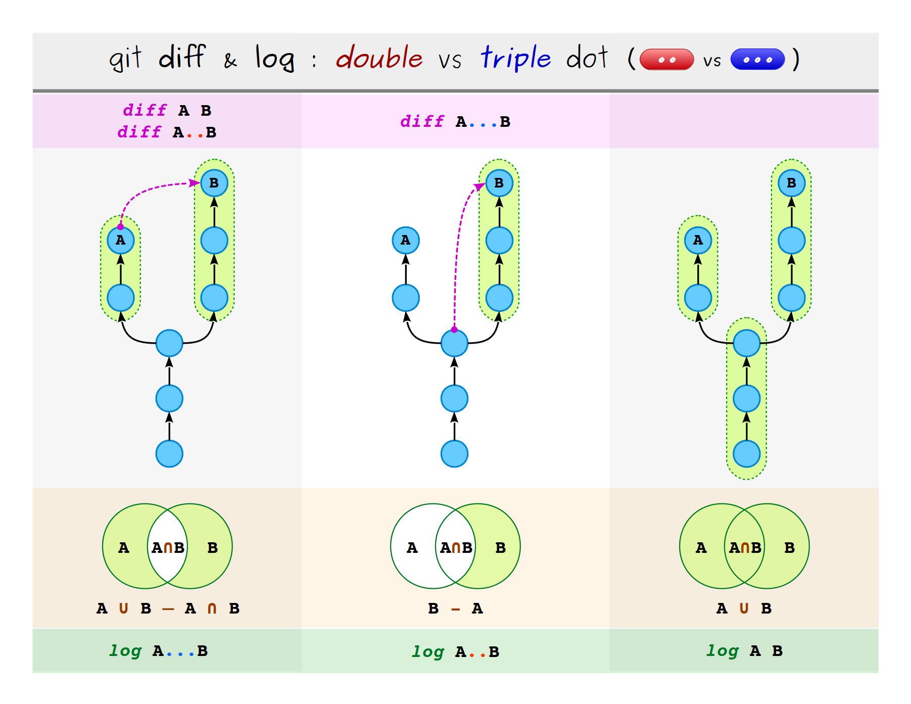
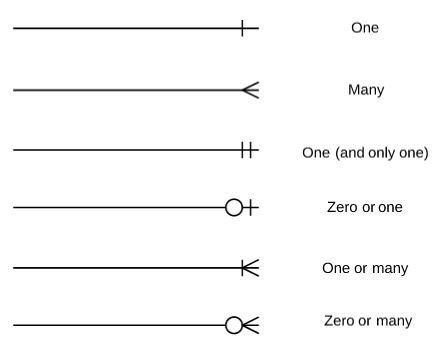

<!-- TODO: move exaplanations to extended.md. -->

# Basic knowledge <!-- omit in toc -->

Basic general concepts to work with.

## Table of contents <!-- omit in toc -->

- [Windows](#windows)
- [Command line](#command-line)
  - [CMD](#cmd)
  - [Bash](#bash)
  - [PowerShell](#powershell)
- [Git](#git)
  - [Basic Git operations](#basic-git-operations)
  - [Multiple repositories to a mono repo](#multiple-repositories-to-a-mono-repo)
  - [Errors and problems](#errors-and-problems)
  - [GitHub](#github)
    - [Compare commits](#compare-commits)
- [Coding](#coding)
  - [Prettier](#prettier)
  - [Angular](#angular)
  - [Cypress](#cypress)
  - [Spring Boot](#spring-boot)
  - [Database](#database)
- [Package managers](#package-managers)
  - [Maven](#maven)
  - [NPM](#npm)
  - [Yarn](#yarn)
- [Browsers](#browsers)
  - [Chrome](#chrome)
  - [Edge](#edge)
- [Tools](#tools)
  - [IntelliJ](#intellij)
    - [Debug](#debug)
- [Others](#others)
  - [YAML](#yaml)

## Windows

- Run batch file from Explorer context menu: [1](https://www.ghacks.net/2017/07/18/how-to-delete-large-folders-in-windows-super-fast/), [2](https://pureinfotech.com/delete-large-folder-fast-windows-10/). <!-- move to extended.md -->
- Close APP connection using specified port:

  ```batch
  netstat -ano | findstr <port>
  taskkill /F /PID <PID>
  ```

- Environment variables: `Control Panel\All Control Panel Items\User Accounts`.
- Credential Manager: `Control Panel\All Control Panel Items\Credential Manager`.
<!-- Panel de control\Todos los elementos de Panel de control\Administrador de credenciales -->

## Command line

- Exit command line: `q`.
- [Redirect messages from command prompt](https://support.microsoft.com/en-us/help/110930/redirecting-error-messages-from-command-prompt-stderr-stdout):

<!-- markdownlint-disable MD033 -->

| Redirected stream        | Instruction                                  | Example                                  | More                                                                  |
| ------------------------ | -------------------------------------------- | ---------------------------------------- | --------------------------------------------------------------------- |
| STDOUT                   | `<command> > <file>`, `<command> 1> <file>`  | `dir > stdout.txt`                       | <ul><li>The file can be `nul`.</li><li>Use `>>` for append.</li></ul> |
| STDERR                   | `<command> 2> <file>`                        | `dir abc.xxx 2> stderr.txt`              | ^                                                                     |
| Both in separated files. | `<command> > <stdout file> 2> <stderr file>` | `dir abc.xxx > stdout.txt 2> stderr.txt` | ^                                                                     |
| Both in a single file.   | `<command> > <file> 2>&1`                    | `dir abc.xxx > both.txt 2>&1`            | ^                                                                     |

<!-- markdownlint-enable MD033 -->

### CMD

- Open File Explorer using CMD: `start <path>`, e.g., `start .`.
- Remove -enclose `<names>` or `<path>` with `"` when spaces in the string, e.g., `del /f/s/q "a b"`-:
  - [Files](https://docs.microsoft.com/en-us/windows-server/administration/windows-commands/del): `del /f/s/q <names> > nul`, e.g., `del /f/s/q *.* > nul`.
    - `<names>`: specifies a list of one or more files or directories. Wildcards may be used to delete multiple files. If a directory is specified, all files within the directory will be deleted.
    - `/f`: forces deletion of read-only files.
    - `/s`: deletes specified files from the current directory and all subdirectories. Displays the names of the files as they are being deleted.
    - `/q`: specifies quiet mode. You are not prompted for delete confirmation.
    - `> nul`: disables the console output and improve the performance and speed.
  - [Directory](https://docs.microsoft.com/en-us/windows-server/administration/windows-commands/rmdir): `rmdir /s/q <path>`, e.g., `rmdir /q/s .`.
    - `/s`: deletes a directory tree (the specified directory and all its subdirectories, including all files).
    - `/q`: specifies quiet mode. Does not prompt for confirmation when deleting a directory tree. The `/q` parameter works only if `/s` is also specified.
  - [Add context menu option](https://pureinfotech.com/delete-large-folder-fast-windows-10/).
  - [Rimraf](https://github.com/isaacs/rimraf): it is a cross-platform solution but requires a Node.js package installation.

Use `.` as `<path>` to indicate the current path.

### Bash

- Remove directory: `rm -rf <path>`, e.g., `rm -rf /c/dir`.
  - `-r`: remove directories and their contents recursively.
  - `-f`: ignore nonexistent files, never prompt.

<!-- markdownlint-disable MD033 -->
<!-- REF: https://askubuntu.com/a/731237 -->
<!-- TODO: save as image. -->
<details>
  <summary>Redirect batch output to file summary</summary>
  <table style="text-align: center">
    <tr>
      <th rowspan="2">Syntax</th>
      <th colspan="2">Visible in terminal</th>
      <th colspan="2">Visible in file</th>
      <th rowspan="2">Existing file</th>
    </tr>
    <tr>
      <th>StdOut</th>
      <th>StdErr</th>
      <th>StdOut</th>
      <th>StdErr</th>
    </tr>
    <tr>
      <td><i>greater than</i>, ></td>
      <td>no</td>
      <td>yes</td>
      <td>yes</td>
      <td>no</td>
      <td>overwrite</td>
    </tr>
    <tr>
      <td>>></td>
      <td>no</td>
      <td>yes</td>
      <td>yes</td>
      <td>no</td>
      <td>append</td>
    </tr>
    <tr>
      <td>2></td>
      <td>yes</td>
      <td>no</td>
      <td>no</td>
      <td>yes</td>
      <td>overwrite</td>
    </tr>
    <tr>
      <td>2>></td>
      <td>yes</td>
      <td>no</td>
      <td>no</td>
      <td>yes</td>
      <td>append</td>
    </tr>
    <tr>
      <td>&></td>
      <td>no</td>
      <td>no</td>
      <td>yes</td>
      <td>yes</td>
      <td>overwrite</td>
    </tr>
    <tr>
      <td>&>></td>
      <td>no</td>
      <td>no</td>
      <td>yes</td>
      <td>yes</td>
      <td>append</td>
    </tr>
    <tr>
      <td>| tee</td>
      <td>yes</td>
      <td>yes</td>
      <td>yes</td>
      <td>no</td>
      <td>overwrite</td>
    </tr>
    <tr>
      <td>| tee -a</td>
      <td>yes</td>
      <td>yes</td>
      <td>yes</td>
      <td>no</td>
      <td>append</td>
    </tr>
    <tr>
      <td>n.e. (*)</td>
      <td>yes</td>
      <td>yes</td>
      <td>no</td>
      <td>yes</td>
      <td>overwrite</td>
    </tr>
    <tr>
      <td>n.e. (*)</td>
      <td>yes</td>
      <td>yes</td>
      <td>no</td>
      <td>yes</td>
      <td>append</td>
    </tr>
    <tr>
      <td>|& tee</td>
      <td>yes</td>
      <td>yes</td>
      <td>yes</td>
      <td>yes</td>
      <td>overwrite</td>
    </tr>
    <tr>
      <td>|& tee -a</td>
      <td>yes</td>
      <td>yes</td>
      <td>yes</td>
      <td>yes</td>
      <td>append</td>
    </tr>
  </table>
</details>
<!-- markdownlint-enable MD033 -->

<!-- TODO: add stdin: https://tldp.org/LDP/abs/html/io-redirection.html -->

### PowerShell

## Git

### Basic Git operations

| Action                                                                                        | Instruction                                               | Example                                            |
| --------------------------------------------------------------------------------------------- | --------------------------------------------------------- | -------------------------------------------------- |
| Clone a repository.                                                                           | `git clone <url>`                                         | `git clone https://github.com/Clepa/Knowledge.git` |
| Create a branch.                                                                              | `git branch <name>`                                       | `git branch aaa`                                   |
| Switch to branch.                                                                             | `git checkout <name>`                                     | `git checkout aaa`                                 |
| Create and switch to branch.                                                                  | `git checkout -b <name>`                                  | `git checkout -b aaa`                              |
| List branches: `-l` for local and `-r` for remote.                                            | `git branch -l`, `git branch -r`                          |                                                    |
| Delete local branches: `-D` for `--delete --force`.                                           | `git branch -d <names>`                                   | `git branch -d aaa bbb`                            |
| Delete remote branches.                                                                       | `git push -d <remote> <names>`                            | `git push -d origin aaa bbb`                       |
| Push multiple branches and add tracking reference.                                            | `git push -u <remote> <names>`                            | `git push -u origin aaa bbb`                       |
| [Push all branches at once and add tracking reference](https://stackoverflow.com/a/14541136). | `git push -u --all <remote>`                              | `git push -u --all origin`                         |
| [Search text in commits](https://stackoverflow.com/a/5816177).                                | `git log -p --source --all -S "<text>"`                   | `git log -p --source --all -S "nowledge"`          |
| ^                                                                                             | `git log -p --source --all -G "<regex>"`                  | `git log -p --source --all -G "^.*now.*dg.*$"`     |
| Show the last edition of the indicated lines.                                                 | `git blame -L <start_line>,+<add> <file>`                 | `git blame -L 1,+10 foo.txt`                       |
| Show all the history of the indicated lines.                                                  | `git log --pretty=short -u -L <start_line>,+<add>:<file>` | `git log --pretty=short -u -L 12,+11:foo.txt`      |
| [Ignored files](https://stackoverflow.com/a/467053): _MINGW64 needed for #2 instruction._     | `git status --ignored`                                    |                                                    |
| ^                                                                                             | `git check-ignore -v $(find . -type f -print)`            |                                                    |

- Show Git configuration options: `git config -l --show-origin`.

<!-- TODO: add how to delete multiple branches local/remote -->

[More information](https://git-scm.com/docs/pretty-formats) for `--prettier` used in `git log`: `--pretty="%Cblue%h"`, `--pretty=short`.

[More information about history file modifications](https://stackoverflow.com/questions/8435343/retrieve-the-commit-log-for-a-specific-line-in-a-file).

<!-- Errors/problems:
https://github.com/microsoft/Git-Credential-Manager-for-Windows/issues/56
 -->

### Multiple repositories to a mono repo

<!-- TODO -->
<!-- prettier-ignore -->
Repositoris normal a mono repo conservant commits: [1](https://medium.com/@filipenevola/how-to-migrate-to-mono-repository-without-losing-any-git-history-7a4d80aa7de2), [2](https://medium.com/swlh/migrating-to-monorepo-ee641dd6502a), [3](https://medium.com/lgtm/migrating-to-the-monorepo-582106142654), [4](https://gist.github.com/blpabhishek/cf1de2d596925ba2405a30fedb881181).

### Errors and problems

- Windows crash meanwhile a rebase and shows _Not a git repository_:

<!--
  Windows crash meanwhile a rebase and shows "Not a git repository"
    https://stackoverflow.com/a/26179324
-->

### GitHub

- Press `y` to open a permalink (unique hash) for the file or path.
- [Create a link with selected lines range](https://mariusschulz.com/blog/sharing-line-highlights-in-github-files) of a file, `<github_project_url>/<file>`, add: `#L<start_line>-L<end_line>`, e.g., `#L11-L18`. It's recommended to use it with `y` permalink.

#### Compare commits

<!-- https://help.github.com/en/articles/comparing-commits-across-time -->
<!-- prettier-ignore -->
[Compare commits with GitHub](https://docs.github.com/en/free-pro-team@latest/github/committing-changes-to-your-project/comparing-commits). Add `/compare/` at the end of the project URL and:

| Type           | Command                                 | Example                      | More information                                        |
| -------------- | --------------------------------------- | ---------------------------- | ------------------------------------------------------- |
| Branches       | `<branch1>...<branch2>`                 | `master...feat/add-value`    |                                                         |
| Tags           | `<tag1>...<tag2>`                       | `v.1.0.0...v.1.0.1`          |                                                         |
| Commits        | `<hash1>..<hash2>`                      | `26ba86c6..95908add`         |                                                         |
| Across forks   | `<user1>:<branch1>...<user2>:<branch2>` | `lolo\master...clepa\master` |                                                         |
| Across commits | `/<hash><^>...<hash>`                   | `95908add^^^...95908add`     | Use the `^` notation N times to mean "N commits prior". |

Template: `base..compare` and `base...compare`. Differences between double and triple dots notation: [git diff](https://stackoverflow.com/a/7256391) and [git log](https://stackoverflow.com/a/24186641), [GitHub docs](https://docs.github.com/en/free-pro-team@latest/github/collaborating-with-issues-and-pull-requests/about-comparing-branches-in-pull-requests#three-dot-and-two-dot-git-diff-comparisons), [more](https://matthew-brett.github.io/pydagogue/git_diff_dots.html). **Two dots** shows the differences between `base` and `compare`. **Three dots** shows the differences between `base` and `compare` starting at the last common commit.

<!-- prettier-ignore-start -->
<!-- markdownlint-disable MD033 -->
[](https://stackoverflow.com/a/46345364)
<!--  -->
<!-- markdownlint-enable MD033 -->
<!-- prettier-ignore-end -->

## Coding

### Prettier

- [Add `npm` script to prettify the code easily](https://stackoverflow.com/a/57629631):
  - Install prettier: `npm i prettier --save-dev`.
  - Add the script in `package.json`: `"pretty": "prettier --write <regex>"`, e.g., `"pretty": "prettier --write \"./**/*.{js,jsx,ts,html,scss,json}\""`.
  - Run: `npm run pretty`.

### Angular

- ❗ [npx](https://github.com/zkat/npx): executes `<command>` either from a local `node_modules/.bin`, or from a central cache, installing any packages needed in order for `<command>` to run, e.g. `npx cowsay "Hello World"`. ❗
- For problems deleting `node_modules` due long folder names use rimraf, [1](http://www.nikola-breznjak.com/blog/nodejs/how-to-delete-node_modules-folder-on-windows-machine/), [2](https://stackoverflow.com/a/29685530):

  ```batch
  npx rimraf <path_node_modules>
  REM Or (remove -g for project install):
  npm install -g rimraf
  rimraf <path_node_modules>
  ```

- Elements order HTML tag: `#<id>`, `id=<value>`, `form[Group|Control]Name`, `*ng<op>`, directives, component properties: input followed by output, css styling, others (translations,...), `data-testid`.

### Cypress

- Go to project with it installed, `node_modules\.bin`, and run: `npx cypress open`.

### Spring Boot

- Quick application restarts: [Hot Swapping](https://docs.spring.io/spring-boot/docs/current/reference/html/using-spring-boot.html#using-boot-hot-swapping) and [Developer Tools](https://docs.spring.io/spring-boot/docs/current/reference/html/using-spring-boot.html#using-boot-devtools).

  ```xml
  <dependency>
    <groupId>org.springframework.boot</groupId>
    <artifactId>spring-boot-devtools</artifactId>
    <optional>true</optional>
  </dependency>
  ```

### Database

- Search with ignore case: `SELECT * FROM <table> WHERE UPPER(<table_column>) = UPPER(<value>); -- upper or lower`.
- Editors:
  - SQL-Workbench/J: allows with one click to generates the DDL and export the tables data.
- [Relations](https://softwareengineering.stackexchange.com/questions/345709/erd-many-vs-zero-or-many-one-or-many-crowfoot-notation).
  <!-- prettier-ignore-start -->
  <!-- markdownlint-disable MD033 -->

  [](https://softwareengineering.stackexchange.com/q/345709)
  <!-- markdownlint-enable MD033 -->
  <!-- prettier-ignore-end -->

## Package managers

### Maven

- Run with specific `settings.xml`: `mvn -s <path> <command>` -> `mvn -s C:\config\settings.xml compile`

### NPM

- Show active configuration: `npm config list`.
- Install packages and print logs: `npm install --verbose`.
<!-- TODO: add dependencies tree command. -->

### Yarn

- Show configuration variables: `yarn config list`.
- Install and print logs: `yarn install --verbose`.
- Config global variables:

  ```bash
  yarn config set global-folder <path> # Open .yarnrc and replace with --global-folder.
  yarn config set prefix <path>
  yarn config set cache-folder <path>
  # TODO: add Link path
  ```

Version `1.x`:

| Description                                                                                                          | Set value                              | Current value     |
| -------------------------------------------------------------------------------------------------------------------- | -------------------------------------- | ----------------- |
| [Global installation folder that houses the global `node_modules`](https://classic.yarnpkg.com/en/docs/cli/global/). | `yarn config set global-folder <path>` | `yarn global dir` |
| [Global installed packages](https://classic.yarnpkg.com/en/docs/cli/global/).                                        | `yarn config set prefix <path>`        | `yarn global bin` |
| [Global cache downloaded packages](https://classic.yarnpkg.com/en/docs/cli/cache/).                                  | `yarn config set cache-folder <path>`  | `yarn cache dir`  |

⚠️ For `global dir` exists an [issue](https://github.com/yarnpkg/yarn/issues/5637): open your `.yarnrc` file, find `global-folder` and replace with `--global-folder`. ⚠️

## Browsers

### Chrome

- Remove autocomplete URL: `Shift`+`Del`.
- [Current profile path](https://sessionbuddy.com/chrome-profile-location/): `chrome://version`.

### Edge

- Developer Tools is not working: `PowerShell > Add-AppxPackage -register "C:\Windows\SystemApps\Microsoft.MicrosoftEdgeDevToolsClient_8wekyb3d8bbwe\AppxManifest.xml" -DisableDevelopmentMode -Confirm:$false`.

## Tools

### IntelliJ

#### Debug

- HotSwap: `Ctrl`+`Shift`+`F9`. [Reload modified classes](https://www.jetbrains.com/help/idea/altering-the-program-s-execution-flow.html#reload_classes) and [limitations](https://www.jetbrains.com/help/idea/altering-the-program-s-execution-flow.html#limitations), [topic in GitHub](https://stackoverflow.com/a/6402317).
- To test: [SpringBoot livereload](https://stackoverflow.com/questions/33869606/intellij-15-springboot-devtools-livereload-not-working). <!-- TODO -->

## Others

### YAML

- [Language specifications](https://yaml.org/spec/1.2/spec.html).
- [Tools](https://onlineyamltools.com): [minify](https://onlineyamltools.com/minify-yaml).
- Syntax:
  - [\$ref](https://swagger.io/docs/specification/using-ref/).
- Usage:
  - [To Quote or not to Quote](http://blogs.perl.org/users/tinita/2018/03/strings-in-yaml---to-quote-or-not-to-quote.html), [Do I need quotes for strings?](https://stackoverflow.com/a/22235064).
  - [Multiline strings, `>-`](https://stackoverflow.com/a/21699210).

<!-- markdownlint-disable MD003 -->
<!-- markdownlint-disable MD010 -->
<!-- markdownlint-disable MD022 -->
<!-- markdownlint-disable MD033 -->
<!-- markdownlint-disable MD034 -->
<!-- markdownlint-disable MD046 -->
<!--
PENDING
-------
Windows
	W10
		Disable 'Alt+Shift' to change language
			"C:\Windows\system32\rundll32.exe" Shell32.dll,Control_RunDLL input.dll,,{C07337D3-DB2C-4D0B-9A93-B722A6C106E2}{HOTKEYS}

			Windows key > Advanced keyboard settings > Input language hot keys > Between input languages > Change Key Sequence :: Not Assigned

				https://superuser.com/questions/698037/can-i-disable-the-altshift-shortcut-to-change-language-in-windows-8-1-or-win
				https://superuser.com/a/1368543
	Show command line that ran an exe in Task Manager
		Open Task Manager > Right click on columns > Add 'Command line'

Git
	Interactive rebase
		Basic
			git rebase -i
		With other branch as base
			git rebase -i <branch> # branch=origin/master
		From specific hash
			git rebase -i <hash>
		For all the commits
			git rebase -i --root
    For the last N commits
      git rebase -i HEAD~n
	Update authored commit time to now
		git commit --amend --date=now // Requires updated Git version
      https://stackoverflow.com/questions/9110310/update-git-commit-author-date-when-amending
[How to fetch all git branches](https://stackoverflow.com/questions/10312521/how-to-fetch-all-git-branches)
[Linking a pull request to an issue](https://docs.github.com/en/free-pro-team@latest/github/managing-your-work-on-github/linking-a-pull-request-to-an-issue).
-->
